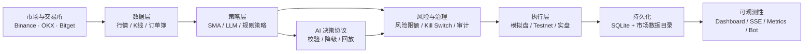

<div align="center">

# Web3 量化交易系统

**面向个人研究与本地部署的全栈量化交易工作台**

从市场数据、策略研究和 AI 辅助分析，到模拟盘、风控闸门、订单同步与可观测性，
将可验证的交易工程能力收敛在一个可自托管的工作台中。

[快速开始](#-快速开始) · [核心能力](#-核心能力) · [架构](#-系统架构) · [文档](#-文档中心) · [参与贡献](#-参与贡献)

[](https://github.com/bilbilmyc/trading/actions/workflows/ci.yml)
[](https://github.com/bilbilmyc/trading/actions/workflows/docker.yml)
[](pyproject.toml)
[](https://fastapi.tiangolo.com/)
[](frontend/package.json)
[](LICENSE)

</div>

> [!WARNING]
> **本项目不是投资建议，也不是托管交易服务。** 它用于个人研究、策略验证和本地运行。默认关闭真实交易；任何真实资金操作都应先在模拟盘与交易所 testnet 完成验证，并由使用者独立承担风险。


## ✨ 为什么选择它

多数交易脚本只覆盖“拉行情”和“发订单”。真正困难的是把研究结论带到执行环节时，仍然保留**约束、审计、回放、降级和可观测性**。

本项目将这些关键环节拆解为可组合的模块：

- **研究到执行可分离**：策略先以信号模式、回测和模拟盘验证，再决定是否进入 testnet 或实盘。
- **多交易所统一抽象**：策略不直接依赖交易所 SDK；现货与合约通过统一接口接入。
- **AI 只做辅助、不绕过风控**：模型输出经过结构化协议、低置信度降级、重复建议拦截和既有风控闸门。
- **每一步可追溯**：订单、风险拦截、AI 输入/输出摘要、后验结果与运行事件都可在工作台和 API 中查询。
- **本地优先、默认安全**：SQLite 持久化、Docker 单机部署、默认 `ENABLE_LIVE_TRADING=false`。

## 🧭 核心能力

| 模块 | 已提供能力 |
| --- | --- |
| **交易所与行情** | Binance Spot / USDⓈ-M、OKX Spot / Swap、Bitget USDT Futures；Ticker、K 线、成交、订单簿、资金费率、价格比较与 WebSocket ticker 订阅 |
| **策略研究** | SMA 双均线、版本化回测、参数网格搜索、严格样本外 Walk-forward 优化、固定参数滚动窗口诊断、交易序列 Monte Carlo 风险分布、Bootstrap 交易样本稳健性测试、固定参数样本内/样本外分析、策略提升治理、市场数据导入与版本化实验记录 |
| **AI 分析** | OpenAI-compatible Provider、技术指标交叉验证、版本化决策协议、`observe` 观察态、结构化审计、效果评估与规则策略故障回退 |
| **交易执行** | 信号生命周期、订单预览、模拟盘、订单与持仓同步、幂等意图、限价/市价/止损止盈等确定性执行能力 |
| **风险控制** | 仓位与名义价值、止损止盈、逐品种限制、下单频率、每日亏损、最大回撤与 Kill Switch |
| **观测与告警** | 健康检查、审计时间线、SSE、Prometheus `/metrics`、飞书/钉钉/企业微信告警、Telegram 监控 Bot |
| **全栈工作台** | React 19 + Vite + TypeScript：市场、交易、组合、策略、风控、审计、数据、事件与 Bot 监控页面 |
| **持久化** | SQLite（WAL）保存策略、信号、订单、模拟账户、持仓、实验与审计事件 |

## 🏗 系统架构



### 推荐验证路径

```text
数据接入 → 策略信号 → 回测 / Walk-forward → 模拟盘 → Testnet → 小额实盘
                         ↑                      │
                    审计、指标、风险拦截、复盘  ──┘
```

不要跳过中间环节。真实交易前必须确认交易所凭据、`AUTH_API_KEY`、风险阈值、交易对范围和 Kill Switch 行为均符合预期。

## 🚀 快速开始

### 方式一：Docker Compose（推荐）

适合首次体验、演示和单机自托管。镜像会构建前端静态文件，并由 FastAPI 在同一 `:8000` 服务中提供工作台和 API。

```bash
# 1) 克隆仓库
git clone https://github.com/bilbilmyc/trading.git
cd trading

# 2) 创建本地配置（不要提交 .env）
cp .env.example .env

# 3) 启动 API + 前端工作台
docker compose up --build -d

# 4) 检查健康状态
curl http://127.0.0.1:8000/health
```

Windows PowerShell 可使用：

```powershell
Copy-Item .env.example .env
Docker compose up --build -d
Invoke-WebRequest http://127.0.0.1:8000/health
```

启动后访问：

| 地址 | 用途 |
| --- | --- |
| `http://127.0.0.1:8000` | 交易工作台 |
| `http://127.0.0.1:8000/docs` | Swagger / OpenAPI 交互文档 |
| `http://127.0.0.1:8000/openapi.json` | OpenAPI JSON |
| `http://127.0.0.1:8000/metrics` | Prometheus 指标 |

常用运维命令：

```bash
docker compose ps                 # 查看服务状态
docker compose logs -f api        # 跟踪服务日志
docker compose up --build -d      # 代码或依赖更新后重建
docker compose down               # 停止服务，保留数据卷
```

> [!TIP]
> SQLite 数据保存在 Docker named volume 中。`docker compose down -v` 会删除数据卷；执行前请确认不再需要历史策略、订单和审计数据。

### 方式二：本地开发（API 与前端热更新）

**前置条件**：Python `3.13+`、Node.js `22+`、pnpm `11.10.0`、以及 [uv](https://docs.astral.sh/uv/)。

```bash
# 启用 pnpm 并安装锁定依赖
corepack enable
uv sync --all-extras --dev --frozen
cd frontend && pnpm install --frozen-lockfile && cd ..

# 创建本地配置
cp .env.example .env
```

分别启动后端与前端：

```bash
# 终端 1：FastAPI
uv run python main.py api --host 127.0.0.1 --port 8000

# 终端 2：Vite
cd frontend
pnpm dev
```

开发地址：

- 前端开发服务器：`http://127.0.0.1:5180`
- 后端 API：`http://127.0.0.1:8000`
- API 文档：`http://127.0.0.1:8000/docs`

### 常用开发命令

```bash
make help            # 列出常用命令（Windows 请在 WSL 或 Git Bash 中使用）
make install         # 安装后端与前端锁定依赖
make dev             # 同时启动 API :8000 和 Vite :5180
make lint            # Ruff（app/config）+ 前端 TypeScript 类型检查
make test            # 后端 pytest（无覆盖率）
make test-frontend   # 前端 Vitest
make ci              # 本地完整质量门禁
```

PowerShell 中可直接运行：

```powershell
uv run ruff check app/ config/
uv run pytest tests/ -q --no-cov
Set-Location frontend; pnpm typecheck; pnpm test:run; pnpm build
```

## 🔐 默认安全姿态

项目默认遵循“先拒绝、再显式开启”的原则：

| 控制项 | 默认行为 | 作用 |
| --- | --- | --- |
| `ENABLE_LIVE_TRADING` | `false` | 未显式启用时不注册可交易所连接，不允许真实交易 |
| 交易所 testnet | `true` | Binance、OKX、Bitget 配置默认使用测试环境 |
| API 鉴权 | 空值时关闭；建议生产环境设置 | `AUTH_API_KEY` 开启后，受保护接口需要 Bearer Token |
| 风险阈值 | 保守默认值 | 限制仓位、名义价值、每日亏损、回撤与下单频率 |
| Kill Switch | 可即时启用 | 阻断新开仓，便于处理异常行情或运行故障 |
| LLM 执行 | 经策略与风控链路 | 低置信度、未来数据、异常结构和重复建议不会直接生成可执行建议 |

最小化配置示例：

```dotenv
# 永远先保持关闭；完成 testnet 验证后再谨慎评估是否改为 true
ENABLE_LIVE_TRADING=false

# 强烈建议为管理和交易接口设置随机密钥
AUTH_API_KEY=replace-with-a-long-random-secret

# 仅在需要 AI 辅助分析时配置
LLM_API_KEY=
LLM_BASE_URL=https://api.openai.com/v1
LLM_MODEL=gpt-4o-mini
```

完整变量与注释请以 [`.env.example`](.env.example) 为准；生产部署和密钥管理请阅读[安全指南](docs/security.md)。

## 🤖 AI 决策：辅助分析，而非自动放行

AI 模块通过 OpenAI-compatible 接口接入模型，组合市场行情、技术指标、仓位、风险状态、历史交易、回测表现和近期 AI 决策进行分析。模型输出不会直接跳过交易规则：

1. **结构化协议**：`v4` 输出包含决策、置信度、市场状态、理由、风险因素、止损止盈、仓位、失效条件、数据时间与版本信息。
2. **安全校验**：未来数据、非法枚举、超限仓位、无效止损止盈等输出会被拒绝。
3. **行为降级**：低置信度或重复开仓建议转为 `observe`，不会被策略层当作买卖信号。
4. **可回放审计**：输入/输出摘要、Provider、版本、耗时和拦截原因都会记录；结果以独立 outcome 事件追加，不改写历史决策。
5. **效果评估**：通过 `/api/v1/ai/insights` 查看命中率、置信度分桶收益、MFE/MAE、成本覆盖率与模型版本表现。

详细字段和 API 请阅读 [AI 决策协议与效果评估](docs/api.md#ai-决策协议审计与效果评估)。

## 📡 API 与可观测性

FastAPI 自动生成 OpenAPI 文档；完整路由、鉴权和错误响应以 [API 参考](docs/api.md) 为准。

```bash
# 健康检查
curl http://127.0.0.1:8000/health

# 使用 Bearer Token 查询受保护资源（配置 AUTH_API_KEY 后）
curl -H "Authorization: Bearer $AUTH_API_KEY" \
  "http://127.0.0.1:8000/api/v1/ai/insights?minutes=60"

# 查询 Prometheus 指标
curl http://127.0.0.1:8000/metrics
```

| 能力 | 入口 |
| --- | --- |
| HTTP / OpenAPI | `/docs`、`/openapi.json` |
| 健康检查 | `/health` |
| 指标 | `/metrics` |
| 风险、订单与审计 | 工作台页面 + `/api/v1/*` |
| AI 决策复盘 | `/api/v1/ai/decisions`、`/replay`、`/outcome` |
| 事件与告警 | SSE、Webhook、Telegram Bot |

监控部署建议见 [可观测性指南](docs/observability.md)，Webhook 见[告警配置](docs/alerts.md)，Telegram 命令与日报见 [Bot 文档](docs/bot.md)。

## 🖥 工作台预览

前端采用 React 19、Vite、TypeScript 与 Wouter，按页面懒加载。它不是单纯的下单面板，而是围绕“研究—验证—执行—复盘”设计的本地控制台：

| 页面 | 关注点 |
| --- | --- |
| Markets / Watchlist | 行情、Top Movers、盘口与自选列表 |
| Trade / Portfolio | 下单预览、持仓、余额、交易历史与同步状态 |
| Strategies | 策略配置、信号、回测、Walk-forward 与治理记录 |
| Risk | 风险限额、Kill Switch、风险事件与仓位暴露 |
| Audit / Events | 订单、策略、LLM 与风险拦截的时间线 |
| Data / Settings | 市场数据导入、数据版本、连接与基础配置 |
| Bot Monitor | Telegram 监控 Bot 状态、告警与日报配置 |

## 🗂 项目结构

```text
trading/
├── app/
│   ├── api/            # FastAPI 路由、鉴权、缓存与 SSE
│   ├── core/           # SQLite、日志与基础设施
│   ├── data_sources/   # 市场数据源与导入
│   ├── engine/         # 执行、风控、回测、LLM、同步与监控
│   ├── exchanges/      # 交易所与现货/合约适配器
│   ├── models/         # 订单、持仓、余额等领域模型
│   └── strategies/     # SMA、LLM 与策略基类
├── config/             # Pydantic Settings
├── frontend/           # React 19 + Vite + TypeScript 工作台
├── docs/               # 部署、API、安全、可观测性和路线图
├── tests/              # 后端单元与 API 集成测试
├── main.py             # API / trade / bot CLI 入口
├── docker-compose.yaml # 单机部署编排
└── Makefile            # 本地开发与 CI 常用命令
```

## 📚 文档中心

| 你想做什么 | 阅读这里 |
| --- | --- |
| 了解所有文档入口 | [文档总览](docs/README.md) |
| 部署、升级或排障 | [部署与运行指南](docs/deployment.md) |
| 调用 HTTP API | [API 参考](docs/api.md) |
| 配置实盘保护和密钥 | [安全指南](docs/security.md) |
| 接入飞书、钉钉、企业微信告警 | [告警配置](docs/alerts.md) |
| 配置 Telegram 监控 Bot | [Bot 文档](docs/bot.md) |
| 配置 Prometheus / 排查运行状态 | [可观测性](docs/observability.md) |
| 查看完成度与已知限制 | [项目状态](docs/STATUS.md) |
| 查看阶段性计划 | [开发待办](docs/TODO.md) |
| 了解变更历史 | [CHANGELOG](CHANGELOG.md) |

## 🛣 路线图

项目以可验证的交易工程为优先，而不是堆叠不可控的自动交易功能。

- [x] 统一交易所与行情接口
- [x] 策略、回测、Walk-forward 与模拟盘基础闭环
- [x] 风控闸门、审计、同步与可观测性基础能力
- [x] 结构化 AI 决策、回放与效果评估
- [ ] 组合级风险体系：相关性、集中度、波动率自适应仓位和归因
- [ ] 更丰富的执行模型与盘口模拟
- [ ] 持续收紧类型检查、测试覆盖与部署自动化

具体实施顺序与验收标准以 [`docs/TODO.md`](docs/TODO.md) 为准。

## 🤝 参与贡献

欢迎 issue、文档改进、测试补充和聚焦明确的功能 PR。提交前请：

1. 阅读 [贡献指南](CONTRIBUTING.md)。
2. 从最新 `main` 创建独立分支；一个 PR 聚焦一个主题。
3. 运行与改动相关的测试；提交前尽量运行 `make ci`。
4. 在 PR 描述中说明动机、变更范围和验证方式。

安全问题请不要公开提交 issue，改用 [SECURITY.md](SECURITY.md) 中的私下报告方式。

## 📄 许可证

本项目采用 [LICENSE](LICENSE) 中声明的许可证发布。

---

<div align="center">

如果这个项目对你的研究或本地工作流有帮助，欢迎 ⭐ Star、Fork 或提交改进建议。

</div>
