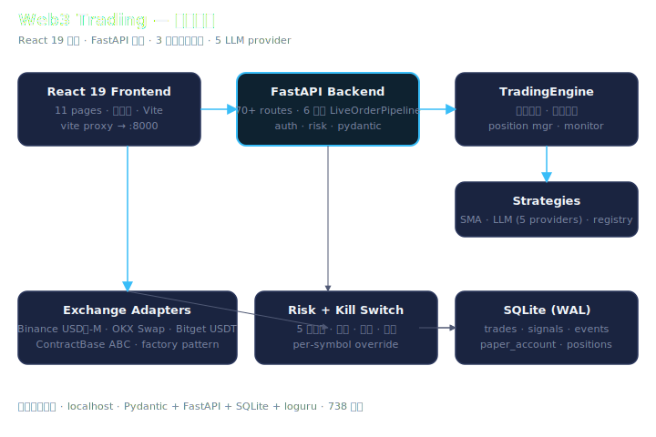
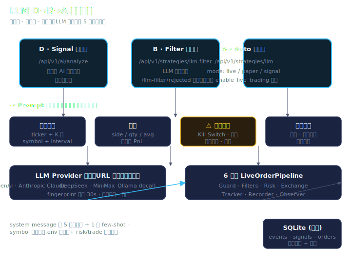

# Web3 量化交易系统

一个基于 Python/asyncio 的 Web3 量化交易系统，以 Binance 为主、Bitget 为辅、OKX 备用，支持统一 **现货 + 永续合约**接口，
内置 SMA 策略、**大模型 AI 分析**、风控、订单/持仓同步和监控告警。



> ⚠️ **风险提示**：默认关闭真实下单。只有显式设置 `ENABLE_LIVE_TRADING=true` 后 API 才允许下单和撤单。
> 实盘前务必在 **testnet** 验证完整流程。

---

## 功能一览

| 模块 | 功能 |
|------|------|
| **交易所接入** | Binance 现货/USD-M Futures + Bitget USDT Futures + OKX 现货/永续，统一抽象接口 |
| **交易引擎** | 多交易所、多策略并行、并发控制、生命周期管理 |
| **策略** | SMA 双均线 (内置) + **LLMAnalyzer 大模型分析 (新增)** |
| **风控** | 仓位/金额/频率/每日亏损/回撤限制 |
| **订单同步** | 定时从交易所拉取订单状态，更新本地记录 |
| **持仓同步** | 定时同步余额和合约持仓到 PositionManager |
| **监控告警** | 引擎健康、网络断开、风控触发 → 结构化 Alert |
| **模拟盘** | 内存 USDT 模拟账户，支持信号模拟执行 |
| **审计持久化** | SQLite 保存策略、信号、模拟盘状态、订单/风控事件 |
| **AI 分析** | 接入 OpenAI/Claude/DeepSeek/Ollama 分析市场，辅助决策 |
| **WebSocket** | Ticker 订阅/取消订阅/断线重连 |
| **REST API** | FastAPI 服务，查询行情/K 线/余额/挂单/下单/撤单/合约操作/引擎状态 |
| **前端** | React + Vite + TypeScript 合约交易工作台 |

---

## 目录

- [快速开始](#快速开始)
- [运行](#运行)
- [阶段 5：实盘自动交易](#阶段-5实盘自动交易)
- [AI 大模型分析](#ai-大模型分析)
- [LLM 策略：D→B→A 三层架构](#llm-策略db-a-三层架构)
- [前端工作台](#前端工作台)
- [Docker](#docker)
- [API 参考](#api-参考)
- [项目结构](#项目结构)
- [后续开发](#后续开发)
- [常见问题](#常见问题)

---

## 快速开始

```bash
# 1. 安装 uv（Python 项目管理）
curl -LsSf https://astral.sh/uv/install.sh | sh

# 2. 创建环境 + 安装依赖
cd trading
uv venv --managed-python
source .venv/bin/activate
uv sync

# 3. 配置
cp .env.example .env
# 编辑 .env：填入交易所 testnet API Key（可选，查行情不需要）
# 默认使用 SQLite 持久化到 data/trading.sqlite3，可通过 SQLITE_PATH 修改

# 4. 启动 API
uv run python main.py api

# 5. 验证
curl http://127.0.0.1:8000/health
curl http://127.0.0.1:8000/api/v1/exchanges
```

---

## 运行

### 查看状态

```bash
uv run python main.py status
```

### 启动 API 服务

```bash
uv run python main.py api --host 0.0.0.0 --port 8000
# 多 worker：
uv run python main.py api --host 0.0.0.0 --port 8000 --workers 4
```

### 运行策略循环

```bash
uv run python main.py trade
```

### API 文档

启动后访问：

```text
http://127.0.0.1:8000/docs
```

### FastAPI 调用关系速读

后端 HTTP 层主要在 `app/api/server.py`。先按这条链看，代码会清楚很多：

```text
main.py api
  -> uvicorn 启动
  -> create_app()
  -> AppState(settings)
  -> @app.get/post/delete 路由函数
  -> Depends(get_state) 注入同一个 AppState
  -> state.get_exchange() / state.engine / state.store
  -> 交易所适配器、交易引擎、SQLite
```

几个关键点：

- `create_app()`：装配整个 FastAPI 应用，创建运行时对象、注册中间件和路由。
- `AppState`：一个 API worker 里的共享上下文，放配置、SQLite、交易引擎和交易所客户端缓存。
- `Depends(get_state)`：FastAPI 的依赖注入。请求进来时自动把 `AppState` 传给路由函数。
- `call_exchange(...)`：统一包住交易所网络调用，把交易所错误转成稳定的 HTTP 响应。
- `reject_live_disabled(...)`：实盘关闭时拦截下单/撤单/改杠杆，同时写入审计事件。
- `POST /api/v1/contracts/order/preview`：真实下单前的预览入口，生成 `client_order_id`，估算名义价值、保证金、手续费和强平风险提示。

---

## 阶段 5：实盘自动交易

阶段 5 打通了从策略信号到实盘执行的完整链路，同时保护你不会意外全仓。

### 架构

```text
┌─────────┐  信号   ┌────────────┐  风控通过   ┌────────────┐
│ 策略     │───────→│ TradingEngine │─────────→│ Exchange   │
│ SMA/LLM  │        │ _execute_signal │         │ place_order│
└─────────┘        └────────────┘         └────────────┘
                           │
                    ┌──────┼──────┐
                    │      │      │
               OrderSync PositionSync Monitor
               (拉取订单) (拉取持仓) (健康告警)
```

### 6 个子系统

| # | 子系统 | 说明 | 启用方式 |
|---|--------|------|---------|
| 1 | **策略信号** | 策略产生 Signal(buy/sell/hold) | `POST /api/v1/strategies/{name}/start` |
| 2 | **风控检查** | RiskManager 拦截超限订单 | 默认启用 |
| 3 | **执行引擎** | TradingEngine 调用 exchange.place_order | `ENABLE_LIVE_TRADING=true` |
| 4 | **订单同步** | OrderSync 定时拉取交易所订单状态 | 引擎 start() 自动启动 |
| 5 | **持仓同步** | PositionSync 定时同步余额+合约持仓 | 引擎 start() 自动启动 |
| 6 | **监控告警** | Monitor 检查引擎+风控+网络健康 | 引擎 start() 自动启动 |

### 防全仓保护

实盘模式仍受风控限制保护：

```ini
# .env
MAX_POSITION_VALUE=1000        # 单笔最大金额 (USDT)
MAX_DAILY_LOSS=100             # 每日最大亏损
MAX_ORDERS_PER_MINUTE=5        # 每分钟最大订单数
STOP_LOSS_PCT=0.05             # 默认止损 5%
```

所有 API 下单端点（`/api/v1/order`、`/api/v1/contracts/order`）在 `ENABLE_LIVE_TRADING=false` 时返回 **403**。

### 监控与告警

```bash
# 监控面板
curl http://127.0.0.1:8000/api/v1/monitor/status
curl http://127.0.0.1:8000/api/v1/monitor/alerts
curl http://127.0.0.1:8000/api/v1/monitor/last-error

# 同步器状态
curl http://127.0.0.1:8000/api/v1/sync/status

# 手动触发同步
curl -X POST http://127.0.0.1:8000/api/v1/sync/orders/binance_usdm
curl -X POST http://127.0.0.1:8000/api/v1/sync/positions/binance_usdm
```

---

## AI 大模型分析

系统内置 LLMAnalyzer 模块，支持将市场数据发送给大模型分析，返回结构化交易建议。

### 支持的 LLM

| 提供方 | `LLM_BASE_URL` | 推荐模型 |
|--------|----------------|---------|
| **OpenAI** | `https://api.openai.com/v1` | `gpt-4o-mini`（成本低） |
| **DeepSeek** | `https://api.deepseek.com/v1` | `deepseek-chat` |
| **Ollama (本地)** | `http://localhost:11434/v1` | `llama3` |
| **vLLM (本地)** | `http://localhost:8000/v1` | 任意部署模型 |

### 配置

```ini
# .env
LLM_API_KEY=sk-your-key-here
LLM_BASE_URL=https://api.openai.com/v1
LLM_MODEL=gpt-4o-mini
LLM_TEMPERATURE=0.3
LLM_DEFAULT_ORDER_AMOUNT=50    # 单笔默认金额 USDT
```

### 手动分析

```bash
curl -X POST http://127.0.0.1:8000/api/v1/ai/analyze \
  -H 'Content-Type: application/json' \
  -d '{"exchange":"binance_usdm","symbol":"BTCUSDT","interval":"1h","limit":30}'
```

返回示例：

```json
{
  "decision": "buy",
  "confidence": 0.78,
  "reason": "BTC 突破 68500 阻力位后放量站稳，均线多头排列...",
  "suggested_action": "open_long",
  "suggested_quantity": 0.000727,
  "suggested_price": 68750,
  "stop_loss": 67200,
  "take_profit": 71000,
  "risk_level": "medium",
  "risk_note": "上方 70000 整数关口有压力"
}
```

---

## LLM 策略：D→B→A 三层架构



从**观察 → 辅助过滤 → 全自动**，逐步升级，每个阶段都受默认金额保护。

### D 方案：信号顾问（观察）

```bash
# 创建 LLM 策略 (mode=signal)
curl -X POST http://127.0.0.1:8000/api/v1/strategies/llm \
  -H 'Content-Type: application/json' \
  -d '{"exchange":"binance_usdm","symbol":"BTCUSDT",
       "interval":"1h","default_order_amount":50,
       "mode":"signal","enabled":true}'

# 启动信号运行器
curl -X POST http://127.0.0.1:8000/api/v1/runner/start \
  -H 'Content-Type: application/json' \
  -d '{"poll_seconds":300,"candle_limit":80}'

# 查看 LLM 信号
curl http://127.0.0.1:8000/api/v1/signals/recent?limit=5
```

- LLMStrategy 在 `generate_signals()` 中调用 LLM
- `mode=signal`：引擎不执行，信号仅展示在面板
- 每笔 `quantity = default_order_amount / current_price`

### B 方案：混合过滤（SMA + LLM 二次确认）

```bash
# 附加 LLM 过滤器
curl -X POST 'http://127.0.0.1:8000/api/v1/strategies/llm-filter/attach?\
exchange=binance_usdm&symbol=BTCUSDT&default_order_amount=50&min_confidence=0.5'

# 启动 SMA 策略
curl -X POST http://127.0.0.1:8000/api/v1/strategies/sma_5_20_btcusdt/start

# 查看被 LLM 拒绝的信号
curl 'http://127.0.0.1:8000/api/v1/strategies/llm-filter/rejected?limit=10'
```

- SMA 出信号 → `LLMSignalFilter.check()` → LLM 二次确认 → 放行/拒绝
- 方向不一致或置信度不足时拒绝
- 过滤器异常时默认放行，不阻塞交易

### A 方案：全自动执行

```bash
# 切换为 live 模式
curl -X POST http://127.0.0.1:8000/api/v1/strategies/llm_btcusdt_1h/mode \
  -H 'Content-Type: application/json' \
  -d '{"mode":"live"}'

# 启动策略
curl -X POST http://127.0.0.1:8000/api/v1/strategies/llm_btcusdt_1h/start
```

- LLMStrategy `mode=live`：引擎自动执行信号
- 仍经过风控检查 + 过滤器链
- 单笔金额受 `default_order_amount` 限制

---

## 前端工作台

前端是 React + Vite + TypeScript。

```bash
# 先启动后端
uv run python main.py api --host 0.0.0.0 --port 8000

# 再启动前端
cd frontend
npm install
npm run dev
```

访问 `http://127.0.0.1:5173`

功能：

- API/LIVE 状态栏
- Binance USD-M / Bitget USDT Futures / OKX Swap 切换
- 合约 symbol 搜索、数量、价格、杠杆、保证金模式
- 开多/平多/开空/平空方向选择
- Maker/Taker 手续费查询 + 成本估算
- 策略信号面板
- 风控 / 持仓状态展示
- 模拟盘

---

## Docker

```bash
# 构建
docker build -t web3-trading:local .

# 运行
docker run --rm \
  --name web3-trading \
  -p 8000:8000 \
  --env-file .env \
  web3-trading:local

# 访问
open http://127.0.0.1:8000
```

GitHub Actions 自动构建推送到 GHCR：

```bash
docker pull ghcr.io/bilbilmyc/trading:latest
```

---

## API 参考

### 行情数据

```bash
GET  /health
GET  /api/v1/config
GET  /api/v1/exchanges
GET  /api/v1/ticker/{exchange}/{symbol}
GET  /api/v1/klines/{exchange}/{symbol}?interval=1m&limit=100
GET  /api/v1/trades/{exchange}/{symbol}?limit=50
```

### 账户与订单

```bash
GET  /api/v1/balances/{exchange}
GET  /api/v1/balances/{exchange}/available
GET  /api/v1/order/{exchange}/{symbol}/{order_id}
GET  /api/v1/orders/{exchange}/open?symbol=BTCUSDT
POST /api/v1/order                          # 需 ENABLE_LIVE_TRADING
POST /api/v1/contracts/order/preview        # 下单前预览，不会真实提交
POST /api/v1/contracts/order                # 合约专用，需 ENABLE_LIVE_TRADING
DELETE /api/v1/order/{exchange}/{symbol}/{order_id}
DELETE /api/v1/orders/{exchange}/open
```

### 合约

```bash
GET  /api/v1/contracts/{exchange}?search=BTC&limit=200
GET  /api/v1/contracts/{exchange}/{symbol}/fee-rate
GET  /api/v1/contracts/{exchange}/{symbol}/cost-estimate?quantity=1&price=100000&liquidity=maker
POST /api/v1/contracts/{exchange}/{symbol}/leverage?leverage=3&margin_mode=cross
```

### 引擎与策略

```bash
GET   /api/v1/engine/status
GET   /api/v1/strategies
POST  /api/v1/strategies/sma                          # 创建 SMA 策略
POST  /api/v1/strategies/llm                          # 创建 LLM 策略
POST  /api/v1/strategies/{name}/start
POST  /api/v1/strategies/{name}/stop
POST  /api/v1/strategies/{name}/mode                  # signal|paper|live
DELETE /api/v1/strategies/{name}
```

### 信号运行器

```bash
GET   /api/v1/runner/status
POST  /api/v1/runner/start     {"poll_seconds":60, "candle_limit":80}
POST  /api/v1/runner/stop
POST  /api/v1/runner/run-once
GET   /api/v1/signals/recent?limit=20
POST  /api/v1/signals/evaluate?exchange=binance_usdm&symbol=BTCUSDT
GET   /api/v1/events/recent?category=risk&limit=30
```

### 模拟盘

```bash
GET  /api/v1/paper
POST /api/v1/paper/reset   {"initial_cash": 10000}
```

### AI 分析

```bash
POST /api/v1/ai/analyze
  {"exchange":"binance_usdm","symbol":"BTCUSDT","interval":"1h","limit":30}
```

### LLM 策略管理

```bash
POST  /api/v1/strategies/llm                 # 创建 LLM 策略
POST  /api/v1/strategies/llm-filter/attach    # 附加 LLM 过滤器
GET   /api/v1/strategies/llm-filter/rejected  # 被拒信号列表
```

### 监控与同步

```bash
GET   /api/v1/monitor/status
GET   /api/v1/monitor/alerts?level=error&limit=50
GET   /api/v1/monitor/last-error
GET   /api/v1/sync/status
POST  /api/v1/sync/orders/{exchange}
POST  /api/v1/sync/positions/{exchange}
```

---

## 项目结构

```text
.
├── main.py                     # CLI 入口
├── config/
│   ├── __init__.py
│   └── settings.py             # 全部配置（风控/AI/监控/同步）
├── app/
│   ├── api/server.py           # FastAPI 路由
│   ├── core/                   # 日志、并发
│   ├── engine/
│   │   ├── trader.py           # 核心引擎
│   │   ├── risk_manager.py     # 风控
│   │   ├── position_manager.py # 持仓
│   │   ├── paper_trading.py    # 模拟盘
│   │   ├── order_sync.py       # 订单同步
│   │   ├── position_sync.py    # 持仓同步
│   │   ├── monitor.py          # 监控告警
│   │   └── llm_filter.py       # LLM 信号过滤器 (B)
│   ├── exchanges/              # 交易所适配器
│   │   ├── base.py             # ExchangeBase 抽象
│   │   ├── contract_base.py    # 合约抽象
│   │   ├── factory.py          # 工厂/单例
│   │   ├── binance.py / binance_usdm.py
│   │   ├── bitget_usdt_futures.py
│   │   └── okx.py / okx_swap.py
│   ├── models/                 # 数据模型
│   │   ├── order.py / position.py / balance.py
│   │   ├── market.py           # Ticker / Candlestick / Trade
│   │   └── contract.py         # 合约请求/费率/估算
│   └── strategies/
│       ├── base.py             # StrategyBase + Signal
│       ├── sma.py              # SMA 双均线
│       ├── llm_analyzer.py     # LLM 调用/ Prompt/ 解析
│       └── llm_strategy.py     # LLMStrategy (D/A)
├── frontend/                   # React 工作台
│   ├── src/App.tsx / api.ts / styles.css
│   └── package.json
├── docs/
│   ├── architecture.svg        # 架构图
│   └── llm-architecture.svg    # LLM 三层架构图
├── Dockerfile
├── .env.example
└── pyproject.toml
```

## 后续开发

后续任务以专业量化系统为目标拆分在 [TODO.md](TODO.md)，包括数据层、回测、组合风控、OMS/EMS、监控运维和测试体系。下次继续开发时优先从 `Next Best Task` 开始。

---

## 常见问题

### uv 找不到

```bash
export PATH="$HOME/.local/bin:$PATH"
```

### API 不能下单

```bash
# 检查 .env
ENABLE_LIVE_TRADING=true
```

确认 API key 配置正确。实盘前先用 testnet。

### LLM 分析返回 "未配置 API Key"

```bash
# 在 .env 中配置
LLM_API_KEY=sk-xxx
LLM_BASE_URL=https://api.openai.com/v1
```

未配置时端点依然可用，返回 `hold` + 提示。

### Docker 拉取私有镜像

```bash
echo <GITHUB_TOKEN> | docker login ghcr.io -u <USER> --password-stdin
```

---

## 后续路线

- [ ] 单元测试：交易所签名、symbol 标准化、风控拦截
- [x] 订单/风控事件持久化：SQLite
- [ ] 完整 OMS 订单状态持久化：PostgreSQL/SQLite migration
- [ ] 私有 WebSocket：订单成交推送
- [ ] 多用户认证
- [ ] 策略回测框架
