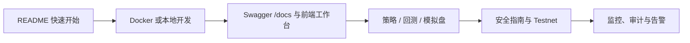

# 文档中心

> 根目录 [README](../README.md) 面向第一次使用项目的读者；本目录提供部署、API、安全、运维和研发过程中的详细参考。

## 按目标开始

| 目标 | 推荐阅读 |
| --- | --- |
| **5 分钟启动工作台** | [快速开始](../README.md#-快速开始) → [部署与运行指南](deployment.md) |
| **调用 API 或开发前端** | [HTTP API 参考](api.md) → 启动后的 `/docs` → [`frontend/src`](../frontend/src) |
| **回测策略、模拟盘或准备 testnet** | [安全指南](security.md) → [项目状态](STATUS.md) → [开发待办](TODO.md) |
| **部署、监控或排障** | [部署指南](deployment.md) → [可观测性](observability.md) → [告警配置](alerts.md) |
| **配置 Telegram 监控 Bot** | [Bot 文档](bot.md) |
| **理解 AI 输入、拦截、回放与效果指标** | [API 中的 AI 决策章节](api.md#ai-决策协议审计与效果评估) → [安全指南](security.md) |

## 文档索引

### 产品与入门

- [根目录 README](../README.md)：项目概览、核心能力、快速开始与贡献入口。
- [项目状态](STATUS.md)：当前完成度、已知限制和优先级评估。
- [开发待办](TODO.md)：分阶段功能清单、验收标准与下一阶段开工任务。
- [变更日志](../CHANGELOG.md)：可追溯的功能变化。

### 使用与集成

- [部署与运行指南](deployment.md)：Docker、本地开发、升级、数据卷、健康检查和排障。
- [HTTP API 参考](api.md)：鉴权、路由、请求/响应和错误处理。
- [安全指南](security.md)：实盘开关、风险闸门、密钥与漏洞报告。
- [告警配置](alerts.md)：飞书、钉钉与企业微信 Webhook。
- [Telegram Bot](bot.md)：监控 Bot、日报、静默时段和访问范围。

### 运维与架构

- [可观测性](observability.md)：Prometheus、SSE、告警建议、订单与账户对账。
- [系统架构图](architecture.svg)：系统主要组件与数据流。
- [LLM 架构图](llm-architecture.svg)：AI 分析与风险保护链路。

## 建议阅读路径



## 文档维护约定

- 面向用户的行为变化，先更新 README 或对应指南，再更新示例与代码。
- 配置项以 [`.env.example`](../.env.example) 为单一事实来源；新增配置时同步更新注释和说明。
- 路由说明以 FastAPI `/docs` 和 [`api.md`](api.md) 为准；README 仅保留快速入口，不复制完整接口清单。
- 命令必须使用当前工具链：后端使用 `uv`，前端使用 `pnpm`；Makefile 适用于 WSL 或 Git Bash，Windows PowerShell 请使用 README 中的直接命令。
- 不写入真实 API key、私有地址、本地数据库内容或未经验证的性能结论。
- 重大架构决策应保留历史记录；不要静默覆盖旧的决策背景。

## 目录结构

```text
docs/
├── README.md              # 本页：文档导航与维护约定
├── deployment.md          # Docker、本地开发、升级与排障
├── api.md                 # HTTP API、鉴权与错误响应
├── security.md            # 实盘保护、密钥管理与 LLM 安全边界
├── observability.md       # metrics、SSE、监控与对账
├── alerts.md              # 飞书、钉钉、企业微信告警
├── bot.md                 # Telegram 监控 Bot
├── STATUS.md              # 完成度与已知限制
├── TODO.md                # 分阶段待办与验收标准
├── architecture.svg       # 系统架构图
└── llm-architecture.svg  # LLM 架构图
```
